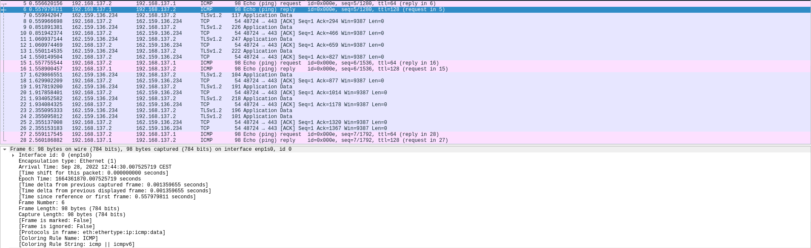
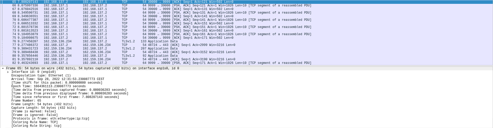
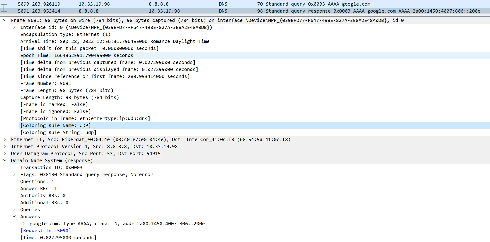

# B2 Réseau 2022 - TP1

# TP1 - Mise en jambes

**Dans ce TP, on va explorer le réseau de vos clients, vos PC.**

Le terme *réseau* désigne au sens large toutes les fonctionnalités d'un PC permettant de se connecter à d'autres machines.  

De façon simplifiée, on appelle *stack TCP/IP* ou *pile TCP/IP* l'ensemble de logiciels qui permettent d'utiliser et configurer des [cartes réseau](../../cours/lexique.md#carte-r%C3%A9seau-ou-interface-r%C3%A9seau) avec des adresses IP.

C'est juste un gros mot savant pour désigner tout ce qui touche de près ou de loin au réseau dans une machine okay ? :)

Lorsque l'on parle de réseau, on désigne souvent par *client* tout équipement qui porte une adresse IP.

Donc vos PCs sont des *clients*, et on va explorer leur *réseau*, c'est à dire, leur *pile TCP/IP*.

# Sommaire
- [B2 Réseau 2022 - TP1](#b2-réseau-2022---tp1)
- [TP1 - Mise en jambes](#tp1---mise-en-jambes)
- [Sommaire](#sommaire)
- [Déroulement et rendu du TP](#déroulement-et-rendu-du-tp)
- [I. Exploration locale en solo](#i-exploration-locale-en-solo)
  - [1. Affichage d'informations sur la pile TCP/IP locale](#1-affichage-dinformations-sur-la-pile-tcpip-locale)
    - [En ligne de commande](#en-ligne-de-commande)
      - [Interface Wifi](#interface-wifi)
      - [Interface Ethernet](#interface-ethernet)
    - [En graphique (GUI : Graphical User Interface)](#en-graphique-gui--graphical-user-interface)
    - [Questions](#questions)
  - [2. Modifications des informations](#2-modifications-des-informations)
    - [A. Modification d'adresse IP (part 1)](#a-modification-dadresse-ip-part-1)
- [II. Exploration locale en duo](#ii-exploration-locale-en-duo)
  - [1. Prérequis](#1-prérequis)
  - [2. Câblage](#2-câblage)
  - [Création du réseau (oupa)](#création-du-réseau-oupa)
  - [3. Modification d'adresse IP](#3-modification-dadresse-ip)
  - [4. Utilisation d'un des deux comme gateway](#4-utilisation-dun-des-deux-comme-gateway)
  - [5. Petit chat privé](#5-petit-chat-privé)
  - [6. Firewall](#6-firewall)
- [III. Manipulations d'autres outils/protocoles côté client](#iii-manipulations-dautres-outilsprotocoles-côté-client)
  - [1. DHCP](#1-dhcp)
  - [2. DNS](#2-dns)
- [IV. Wireshark](#iv-wireshark)
- [Bilan](#bilan)

# Déroulement et rendu du TP

- Groupe de 2 jusqu'à 4 personnes. Il faut au moins deux PCs avec une prise RJ45 (Ethernet) par groupe
- Un câble RJ45 (fourni) pour connecter les deux PCs
- **Un compte-rendu par personne**
  - vu que vous travaillez en groupe, aucun problème pour copier/coller les parties à faire à plusieurs (tout le [`II.`](#ii-exploration-locale-en-duo))
  - une bonne partie est à faire de façon individuelle malgré tout (tout le [`I.`](#i-exploration-locale-en-solo) et le [`III.`](#iii-manipulations-dautres-outilsprotocoles-côté-client))
  - on prendra le temps, mais le travail devra être rendu à travers Github ou tout autre plateforme supportant le `md` (markdown)
- Le rendu doit :
  - comporter des réponses aux questions explicites
  - comporter la marche à suivre pour réaliser les étapes demandées :
    - en ligne de commande, copier/coller des commandes et leurs résultat
    - en interface graphique, screenshots ou nom des menus où cliquer (sinon ça peut vite faire 1000 screenshots)
  - par exemple, pour la partie `1.A.` je veux le la commande tapée et le résultat
    - un copier/coller ça me va très bien, mieux qu'un screen pour de la ligne de commande
  - de façon générale, tout ce que vous faites et qui fait partie du TP, vous me le mettez :)

**⚠️ ⚠️ Désactivez votre firewall pour ce TP. ⚠️ ⚠️**

# I. Exploration locale en solo

## 1. Affichage d'informations sur la pile TCP/IP locale

### En ligne de commande

En utilisant la ligne de commande (CLI) de votre OS :

**🌞 Affichez les infos des cartes réseau de votre PC**

- nom, [adresse MAC](../../cours/lexique/README.md#mac-media-access-control) et adresse IP de l'interface WiFi
- nom, [adresse MAC](../../cours/lexique/README.md#mac-media-access-control) et adresse IP de l'interface Ethernet

```bash
ipconfig /all
```

#### Interface Wifi

- nom : Wireless LAN adapter Wi-Fi
- MAC : 68-54-5A-41-0C-F8
- IP : 10.33.19.98

#### Interface Ethernet

- J'en ai pas (en dehors des virtuels créer par les VM)

**🌞 Affichez votre gateway**

- utilisez une commande pour connaître l'adresse IP de la [passerelle](../../cours/lexique/README.md#passerelle-ou-gateway) de votre carte WiFi

```bash
ipconfig /all
```

- gateway : 10.33.19.254
  
### En graphique (GUI : Graphical User Interface)

En utilisant l'interface graphique de votre OS :  

**🌞 Trouvez comment afficher les informations sur une carte IP (change selon l'OS)**

- trouvez l'IP, la MAC et la [gateway](../../cours/lexique/README.md#passerelle-ou-gateway) pour l'interface WiFi de votre PC

```
Control Panel > Network and Internet > Network and Sharing Center > change adapter settings > left-click [nom de l'interface WiFi] > Status > Details
```

### Questions

- 🌞 à quoi sert la [gateway](../../cours/lexique.md#passerelle-ou-gateway) dans le réseau d'YNOV ?

- La gateway est la passerelle qui permet de communiquer avec les autres réseaux. Elle permet de faire le lien entre les réseaux locaux et les réseaux distants.
## 2. Modifications des informations

### A. Modification d'adresse IP (part 1)  

🌞 Utilisez l'interface graphique de votre OS pour **changer d'adresse IP** :

- changez l'adresse IP de votre carte WiFi pour une autre
- ne changez que le dernier octet
  - par exemple pour `10.33.1.10`, ne changez que le `10`
  - valeur entre 1 et 254 compris

```
Settings > Network & Internet > WiFi > Harware Properties > IP assignement Edit button
```

🌞 **Il est possible que vous perdiez l'accès internet.** Que ce soit le cas ou non, expliquez pourquoi c'est possible de perdre son accès internet en faisant cette opération.

- Il est possible de perdre internet car le server dhcp ne sait pas faire le lien entre la nouvelle adresse ip et une adresse mac qu'il connait

- **NOTE :** si vous utilisez la même IP que quelqu'un d'autre, il se passerait la même chose qu'en vrai avec des adresses postales :
  - deux personnes habitent au même numéro dans la même rue, mais dans deux maisons différentes
  - quand une de ces personnes envoie un message, aucun problème, l'adresse du destinataire est unique, la lettre sera reçue
  - par contre, pour envoyer un message à l'une de ces deux personnes, le facteur sera dans l'impossibilité de savoir dans quelle boîte aux lettres il doit poser le message
  - ça marche à l'aller, mais pas au retour

# II. Exploration locale en duo

Owkay. Vous savez à ce stade :

- afficher les informations IP de votre machine
- modifier les informations IP de votre machine
- c'est un premier pas vers la maîtrise de votre outil de travail

On va maintenant répéter un peu ces opérations, mais en créant un réseau local de toutes pièces : entre deux PCs connectés avec un câble RJ45.

## 1. Prérequis

- deux PCs avec ports RJ45
- un câble RJ45
- **firewalls désactivés** sur les deux PCs

## 2. Câblage

Ok c'est la partie tendue. Prenez un câble. Branchez-le des deux côtés. **Bap.**

## Création du réseau (oupa)

Cette étape peut paraître cruciale. En réalité, elle n'existe pas à proprement parlé. On ne peut pas "créer" un réseau. Si une machine possède une carte réseau, et si cette carte réseau porte une adresse IP, alors cette adresse IP se trouve dans un réseau (l'adresse de réseau). Ainsi, le réseau existe. De fait.

**Donc il suffit juste de définir une adresse IP sur une carte réseau pour que le réseau existe ! Bap.**

## 3. Modification d'adresse IP

🌞Si vos PCs ont un port RJ45 alors y'a une carte réseau Ethernet associée :

- modifiez l'IP des deux machines pour qu'elles soient dans le même réseau
  - choisissez une IP qui commence par "192.168"
  - utilisez un /30 (que deux IP disponibles)
- vérifiez à l'aide de commandes que vos changements ont pris effet
- utilisez `ping` pour tester la connectivité entre les deux machines
- affichez et consultez votre table ARP

```bash
ciremy@ciremy-Aspire-A315-56:~/work/ynov/tp linux/tp-linux$ ping 192.168.0.2
PING 192.168.0.2 (192.168.0.2) 56(84) bytes of data.
64 bytes from 192.168.0.2: icmp_seq=35 ttl=128 time=1.28 ms
64 bytes from 192.168.0.2: icmp_seq=36 ttl=128 time=1.98 ms
ciremy@ciremy-Aspire-A315-56:~/work/ynov/tp linux/tp-linux$ arp -a
_gateway (10.33.19.254) à 00:c0:e7:e0:04:4e [ether] sur wlp2s0
? (169.254.198.183) à b0:22:7a:e1:c7:0e [ether] sur enp1s0
? (192.168.0.2) à b0:22:7a:e1:c7:0e [ether] sur enp1s0

```

## 4. Utilisation d'un des deux comme gateway

Ca, ça peut toujours dépann. Comme pour donner internet à une tour sans WiFi quand y'a un PC portable à côté, par exemple.

L'idée est la suivante :

- vos PCs ont deux cartes avec des adresses IP actuellement
  - la carte WiFi, elle permet notamment d'aller sur internet, grâce au réseau YNOV
  - la carte Ethernet, qui permet actuellement de joindre votre coéquipier, grâce au réseau que vous avez créé :)
- si on fait un tit schéma tout moche, ça donne ça :

```schema
  Internet           Internet
     |                   |
    WiFi                WiFi
     |                   |
    PC 1 ---Ethernet--- PC 2

- internet joignable en direct par le PC 1
- internet joignable en direct par le PC 2
```

- vous allez désactiver Internet sur une des deux machines, et vous servir de l'autre machine pour accéder à internet.

```schema
  Internet           Internet
     X                   |
     X                  WiFi
     |                   |
    PC 1 ---Ethernet--- PC 2

- internet joignable en direct par le PC 2
- internet joignable par le PC 1, en passant par le PC 2
```

- pour ce faiiiiiire :
  - désactivez l'interface WiFi sur l'un des deux postes
  - s'assurer de la bonne connectivité entre les deux PCs à travers le câble RJ45
  - **sur le PC qui n'a plus internet**
    - sur la carte Ethernet, définir comme passerelle l'adresse IP de l'autre PC
  - **sur le PC qui a toujours internet**
    - sur Windows, il y a une option faite exprès (google it. "share internet connection windows 10" par exemple)
    - sur GNU/Linux, faites le en ligne de commande ou utilisez [Network Manager](https://help.ubuntu.com/community/Internet/ConnectionSharing) (souvent présent sur tous les GNU/Linux communs)
    - sur MacOS : toute façon vous avez pas de ports RJ, si ? :o (google it sinon)

---

- 🌞 pour tester la connectivité à internet on fait souvent des requêtes simples vers un serveur internet connu
  - encore une fois, un ping vers un DNS connu comme `1.1.1.1` ou `8.8.8.8` c'est parfait
- 🌞 utiliser un `traceroute` ou `tracert` pour bien voir que les requêtes passent par la passerelle choisie (l'autre le PC)

```bash
ciremy@ciremy-Aspire-A315-56:~/work/ynov/tp linux/tp-linux$ ping 192.168.137.1
PING 192.168.137.1 (192.168.137.1) 56(84) bytes of data.
64 bytes from 192.168.137.1: icmp_seq=1 ttl=128 time=2.44 ms

ciremy@ciremy-Aspire-A315-56:~/work/ynov/tp linux/tp-linux$ ping 1.1.1.1
*PING 1.1.1.1 (1.1.1.1) 56(84) bytes of data.
64 bytes from 1.1.1.1: icmp_seq=1 ttl=54 time=52.3 ms

ciremy@ciremy-Aspire-A315-56:~/work/ynov/tp linux/tp-linux$ traceroute 1.1.1.1
traceroute to 1.1.1.1 (1.1.1.1), 30 hops max, 60 byte packets
 1  192.168.137.1 (192.168.137.1)  8.934 ms  8.874 ms  8.859 ms

```

## 5. Petit chat privé

On va créer un chat extrêmement simpliste à l'aide de `netcat` (abrégé `nc`). Il est souvent considéré comme un bon couteau-suisse quand il s'agit de faire des choses avec le réseau.

Sous GNU/Linux et MacOS vous l'avez sûrement déjà, sinon débrouillez-vous pour l'installer :). Les Windowsien, ça se passe [ici](https://eternallybored.org/misc/netcat/netcat-win32-1.11.zip) (from https://eternallybored.org/misc/netcat/).

Une fois en possession de `netcat`, vous allez pouvoir l'utiliser en ligne de commande. Comme beaucoup de commandes sous GNU/Linux, Mac et Windows, on peut utiliser l'option `-h` (`h` pour `help`) pour avoir une aide sur comment utiliser la commande.

Sur un Windows, ça donne un truc comme ça :

```schema
C:\Users\It4\Desktop\netcat-win32-1.11>nc.exe -h
[v1.11 NT www.vulnwatch.org/netcat/]
connect to somewhere:   nc [-options] hostname port[s] [ports] ...
listen for inbound:     nc -l -p port [options] [hostname] [port]
options:
        -d              detach from console, background mode

        -e prog         inbound program to exec [dangerous!!]
        -g gateway      source-routing hop point[s], up to 8
        -G num          source-routing pointer: 4, 8, 12, ...
        -h              this cruft
        -i secs         delay interval for lines sent, ports scanned
        -l              listen mode, for inbound connects
        -L              listen harder, re-listen on socket close
        -n              numeric-only IP addresses, no DNS
        -o file         hex dump of traffic
        -p port         local port number
        -r              randomize local and remote ports
        -s addr         local source address
        -t              answer TELNET negotiation
        -u              UDP mode
        -v              verbose [use twice to be more verbose]
        -w secs         timeout for connects and final net reads
        -z              zero-I/O mode [used for scanning]
port numbers can be individual or ranges: m-n [inclusive]
```

L'idée ici est la suivante :

- l'un de vous jouera le rôle d'un _serveur_
- l'autre sera le _client_ qui se connecte au _serveur_

Précisément, on va dire à `netcat` d'_écouter sur un port_. Des ports, y'en a un nombre fixe (65536, on verra ça plus tard), et c'est juste le numéro de la porte à laquelle taper si on veut communiquer avec le serveur.

Si le serveur écoute à la porte 20000, alors le client doit demander une connexion en tapant à la porte numéro 20000, simple non ?

Here we go :

- 🌞 **sur le PC _serveur_** avec par exemple l'IP 192.168.1.1
  - `nc.exe -l -p 8888`
    - "`netcat`, écoute sur le port numéro 8888 stp"
  - il se passe rien ? Normal, faut attendre qu'un client se connecte
- 🌞 **sur le PC _client_** avec par exemple l'IP 192.168.1.2
  - `nc.exe 192.168.1.1 8888`
    - "`netcat`, connecte toi au port 8888 de la machine 192.168.1.1 stp"
  - une fois fait, vous pouvez taper des messages dans les deux sens
- appelez-moi quand ça marche ! :)
  - si ça marche pas, essayez d'autres options de `netcat`

```bash
ciremy@ciremy-Aspire-A315-56:~/work/ynov/tp linux/tp-linux$ nc 192.168.137.1 8888
hellohg

sup
sup
sup
sup

```

---

- 🌞 pour aller un peu plus loin
  - le serveur peut préciser sur quelle IP écouter, et ne pas répondre sur les autres
  - par exemple, on écoute sur l'interface Ethernet, mais pas sur la WiFI
  - pour ce faire `nc.exe -l -p PORT_NUMBER IP_ADDRESS`
  - par exemple `nc.exe -l -p 9999 192.168.1.37`
  - on peut aussi accepter uniquement les connexions internes à la machine en écoutant sur `127.0.0.1`

## 6. Firewall

Toujours par 2.

Le but est de configurer votre firewall plutôt que de le désactiver

- Activez votre firewall
- 🌞 Autoriser les `ping`
  - configurer le firewall de votre OS pour accepter le `ping`
  - aidez vous d'internet
  - on rentrera dans l'explication dans un prochain cours mais sachez que `ping` envoie un message _ICMP de type 8_ (demande d'ECHO) et reçoit un message _ICMP de type 0_ (réponse d'écho) en retour
- 🌞 Autoriser le traffic sur le port qu'utilise `nc`
  - on parle bien d'ouverture de **port** TCP et/ou UDP
  - on ne parle **PAS** d'autoriser le programme `nc`
  - choisissez arbitrairement un port entre 1024 et 20000
  - vous utiliserez ce port pour [communiquer avec `netcat`](#5-petit-chat-privé-) par groupe de 2 toujours
  - le firewall du _PC serveur_ devra avoir un firewall activé et un `netcat` qui fonctionne

# III. Manipulations d'autres outils/protocoles côté client

## 1. DHCP

Bon ok vous savez définir des IPs à la main. Mais pour être dans le réseau YNOV, vous l'avez jamais fait.  

C'est le **serveur DHCP** d'YNOV qui vous a donné une IP.

Une fois que le serveur DHCP vous a donné une IP, vous enregistrer un fichier appelé *bail DHCP* qui contient, entre autres :

- l'IP qu'on vous a donné
- le réseau dans lequel cette IP est valable

🌞Exploration du DHCP, depuis votre PC

```bash
ipconfig /all
```

- IP du serveur DHCP : 10.33.19.254
- Date d'expiration du bail DHCP : mercredi 28 septembre 2022 08:59:24

## 2. DNS

Le protocole DNS permet la résolution de noms de domaine vers des adresses IP. Ce protocole permet d'aller sur `google.com` plutôt que de devoir connaître et utiliser l'adresse IP du serveur de Google.  

Un **serveur DNS** est un serveur à qui l'on peut poser des questions (= effectuer des requêtes) sur un nom de domaine comme `google.com`, afin d'obtenir les adresses IP liées au nom de domaine.  

Si votre navigateur fonctionne "normalement" (il vous permet d'aller sur `google.com` par exemple) alors votre ordinateur connaît forcément l'adresse d'un serveur DNS. Et quand vous naviguez sur internet, il effectue toutes les requêtes DNS à votre place, de façon automatique.

- 🌞 trouver l'adresse IP du serveur DNS que connaît votre ordinateur

```bash
ipconfig /all
```

  - Ip du serveur DNS : 8.8.8.8

- 🌞 utiliser, en ligne de commande l'outil `nslookup` (Windows, MacOS) ou `dig` (GNU/Linux, MacOS) pour faire des requêtes DNS à la main


  - faites un *lookup* (*lookup* = "dis moi à quelle IP se trouve tel nom de domaine")
    - pour `google.com`
    - pour `ynov.com`
    - interpréter les résultats de ces commandes
  - déterminer l'adresse IP du serveur à qui vous venez d'effectuer ces requêtes
  - faites un *reverse lookup* (= "dis moi si tu connais un nom de domaine pour telle IP")
    - pour l'adresse `78.74.21.21`
    - pour l'adresse `92.146.54.88`
    - interpréter les résultats
    - *si vous vous demandez, j'ai pris des adresses random :)*

```bash
PS C:\Users\mrtju> nslookup ynov.com
Server:  dns.google
Address:  8.8.8.8

Non-authoritative answer:
Name:    ynov.com
Addresses:  2606:4700:20::681a:ae9
          2606:4700:20::681a:be9
          2606:4700:20::ac43:4ae2
          104.26.11.233
          104.26.10.233
          172.67.74.226
```

```bash
PS C:\Users\mrtju> nslookup google.com
Server:  dns.google
Address:  8.8.8.8

Non-authoritative answer:
Name:    google.com
Addresses:  2a00:1450:4007:808::200e
          216.58.215.46
```

Les 2 passe par le meme server dns (celui de google)

```bash
PS C:\Users\mrtju> nslookup 78.74.21.21
Server:  dns.google
Address:  8.8.8.8

Name:    host-78-74-21-21.homerun.telia.com
Address:  78.74.21.21
```

```bash
PS C:\Users\mrtju> nslookup 92.146.54.88
Server:  dns.google
Address:  8.8.8.8

*** dns.google can't find 92.146.54.88: Non-existent domain
```

les 2 ips utilise le server dns de google, et la 2eme n'as pas de nom de domaine associé

# IV. Wireshark

Wireshark est un outil qui permet de visualiser toutes les trames qui sortent et entrent d'une carte réseau.

Il peut :

- enregistrer le trafic réseau, pour l'analyser plus tard
- afficher le trafic réseau en temps réel

**On peut TOUT voir.**

Un peu austère aux premiers abords, une manipulation très basique permet d'avoir une très bonne compréhension de ce qu'il se passe réellement.

- téléchargez l'outil [Wireshark](https://www.wireshark.org/)
- 🌞 utilisez le pour observer les trames qui circulent entre vos deux carte Ethernet. Mettez en évidence :
  - un `ping` entre vous et la passerelle (1)
  - un `netcat` entre vous et votre mate, branché en RJ45 (2)
  - une requête DNS. Identifiez dans la capture le serveur DNS à qui vous posez la question. (3)
  - prenez moi des screens des trames en question
  - on va prendre l'habitude d'utiliser Wireshark souvent dans les cours, pour visualiser ce qu'il se passe

ping 
netcat 
dns 

# Bilan

**Vu pendant le TP :**

- visualisation de vos interfaces réseau (en GUI et en CLI)
- extraction des informations IP
  - adresse IP et masque
  - calcul autour de IP : adresse de réseau, etc.
- connaissances autour de/aperçu de :
  - un outil de diagnostic simple : `ping`
  - un outil de scan réseau : `nmap`
  - un outil qui permet d'établir des connexions "simples" (on y reviendra) : `netcat`
  - un outil pour faire des requêtes DNS : `nslookup` ou `dig`
  - un outil d'analyse de trafic : `wireshark`
- manipulation simple de vos firewalls

**Conclusion :**

- Pour permettre à un ordinateur d'être connecté en réseau, il lui faut **une liaison physique** (par câble ou par *WiFi*).  
- Pour réceptionner ce lien physique, l'ordinateur a besoin d'**une carte réseau**. La carte réseau porte une [adresse MAC](../../cours/lexique.md#mac-media-access-control).  
- **Pour être membre d'un réseau particulier, une carte réseau peut porter une adresse IP.**
Si deux ordinateurs reliés physiquement possèdent une adresse IP dans le même réseau, alors ils peuvent communiquer.  
- **Un ordintateur qui possède plusieurs cartes réseau** peut réceptionner du trafic sur l'une d'entre elles, et le balancer sur l'autre, servant ainsi de "pivot". Cet ordinateur **est appelé routeur**.
- Il existe dans la plupart des réseaux, certains équipements ayant un rôle particulier :
  - un équipement appelé **[*passerelle*](../../cours/lexique.md#passerelle-ou-gateway)**. C'est un routeur, et il nous permet de sortir du réseau actuel, pour en joindre un autre, comme Internet par exemple
  - un équipement qui agit comme **serveur DNS** : il nous permet de connaître les IP derrière des noms de domaine
  - un équipement qui agit comme **serveur DHCP** : il donne automatiquement des IP aux clients qui rejoigne le réseau
  - **chez vous, c'est votre Box qui fait les trois :)**

🌞 Ce soleil est un troll. **Lisez et prenez le temps d'appréhender le texte de conclusion juste au dessus si ces notions ne vous sont pas familières.**